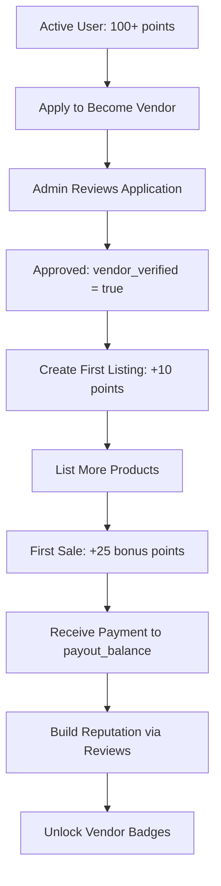
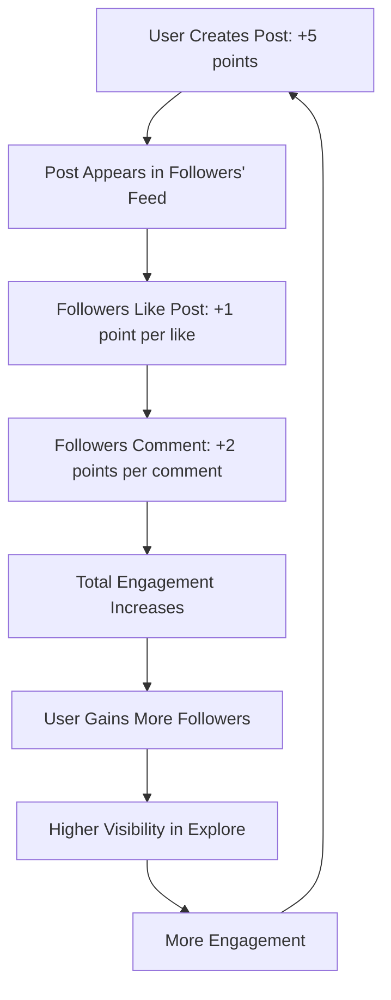

# 🎯 Complete System Capabilities Audit

## Executive Summary

This document provides a comprehensive audit of all three major systems in your Optimix platform: **Social Features**, **Marketplace**, and **Gamification**. Each section details what works, what's integrated, and complete user workflows.

---

## 1️⃣ SOCIAL FEATURES ✅ **FULLY OPERATIONAL**

### What Users Can Do

#### **Post Management**
- ✅ Create posts with text, images (up to 10), hashtags, mentions
- ✅ Edit their own posts (marked as `is_edited`)
- ✅ Delete their own posts (soft delete: `is_deleted=true`)
- ✅ View posts feed with pagination (20 per page default)
- ✅ Filter posts by user, type (text/image/video)
- ✅ Posts automatically award **5 points** via database trigger

#### **Engagement**
- ✅ Like posts (awards post author 1 point automatically)
- ✅ Unlike posts
- ✅ Comment on posts (nested comments supported via `parent_id`)
- ✅ Delete their own comments
- ✅ View comment counts and like counts in real-time
- ✅ Comments award **2 points** to commenter

#### **Following System**
- ✅ Follow other users (awards **3 points**)
- ✅ Unfollow users
- ✅ View followers list with profile info
- ✅ View following list with profile info
- ✅ Cannot follow themselves (validation enforced)
- ✅ Notifications sent to followed user

#### **Real-Time Updates**
- ✅ Posts update live via Supabase Realtime
- ✅ Comments update live
- ✅ Likes update live
- ✅ Follower counts update automatically
- ✅ SocialContext manages real-time subscriptions

### API Routes (6 endpoints)

| Endpoint | Methods | Rate Limits | Gamification |
|----------|---------|-------------|--------------|
| `/api/posts` | GET, POST | 20/100 read, 30 write | +5 points on POST |
| `/api/posts/[id]` | GET, PATCH, DELETE | 20/100 read, 30 write | - |
| `/api/posts/[id]/comments` | GET, POST | 20/100 read, 30 write | +2 points on POST |
| `/api/posts/[id]/like` | POST, DELETE | 30 write | +1 point to author |
| `/api/users/[id]/follow` | GET, POST, DELETE | 20/100 read, 30 write | +3 points on POST |

### Profile Updates

**When users interact with social features:**
- ✅ `points` field updates automatically (database triggers)
- ✅ `posts_count` increments via `increment_user_posts_count()` RPC
- ✅ `follower_count` / `following_count` update automatically (if columns exist)
- ⚠️ `updated_at` does NOT update (only on profile edits)

### Database Triggers Active

```sql
-- Automatically award points for:
✅ post_created → +5 points
✅ post_liked → +1 point to post author
✅ listing_created → +10 points
✅ first_sale → +25 points
```

### Complete User Journey Example

```
User A creates post
  ↓ Trigger awards +5 points
  ↓ Post appears in feed (real-time)
  
User B likes the post
  ↓ POST /api/posts/{id}/like
  ↓ Trigger awards User A +1 point
  ↓ User A sees notification
  ↓ Like count updates (real-time)
  
User B comments
  ↓ POST /api/posts/{id}/comments
  ↓ User B gets +2 points
  ↓ Comment appears (real-time)
  ↓ User A gets notification
  
User B follows User A
  ↓ POST /api/users/{id}/follow
  ↓ User B gets +3 points
  ↓ User A gets notification
  ↓ Follower count increments
```

---

## 2️⃣ MARKETPLACE FEATURES ✅ **OPERATIONAL (Direct Supabase)**

### What Vendors Can Do

#### **Listing Management**
- ✅ Create listings (products/services) via `createListing()`
- ✅ Upload up to 5 images per listing
- ✅ Set price, stock, category, tags
- ✅ Mark listings as active/inactive
- ✅ Edit their own listings via `updateListing()`
- ✅ Delete listings via `deleteListing()`
- ✅ View listings in vendor dashboard
- ✅ Listings award **10 points** on creation (trigger)

#### **Order Management**
- ✅ View all orders via vendor dashboard
- ✅ Filter orders by status (pending/completed/cancelled)
- ✅ Update order status
- ✅ Track total sales and revenue
- ✅ First sale awards **+25 bonus points** (trigger)

#### **Bookings Management**
- ✅ Create booking listings (services with time slots)
- ✅ View booking requests
- ✅ Accept/decline bookings
- ✅ Track pending vs completed bookings

#### **Vendor Dashboard Stats**
- ✅ Total listings count
- ✅ Active listings count
- ✅ Total orders
- ✅ Pending orders
- ✅ Total revenue (completed orders sum)
- ✅ Payout balance (from `vendor_profiles`)
- ✅ Total bookings
- ✅ Pending bookings

### What Customers Can Do

#### **Shopping**
- ✅ Browse marketplace with categories/filters
- ✅ Search listings by keyword
- ✅ View listing details
- ✅ Add items to cart (CartContext)
- ✅ Update cart quantities
- ✅ Remove from cart
- ✅ View total price with cart

#### **Purchasing**
- ✅ Checkout via Stripe payment intent
- ✅ Orders created via Supabase Edge Function
- ✅ Stock decrements automatically (`decrement_stock()` function)
- ✅ Order confirmation email (if configured)
- ✅ Purchases award **10 points + 10% credits**

#### **Bookings**
- ✅ Book services with time slots
- ✅ View booking history
- ✅ Cancel bookings (if allowed)
- ✅ Booking creation awards **8 points**

#### **Reviews** (Partially Implemented)
- ✅ Database table exists (`reviews`)
- ✅ Review creation awards **5 points**
- ⚠️ Frontend review form needs implementation
- ⚠️ No API route for reviews yet

### API Implementation

**Note:** Marketplace uses **direct Supabase client calls** instead of dedicated API routes.

| Function | Location | Auth | Gamification |
|----------|----------|------|--------------|
| `createListing()` | `src/lib/api.ts` | Vendor only | +10 points |
| `updateListing()` | `src/lib/api.ts` | Owner only | - |
| `deleteListing()` | `src/lib/api.ts` | Owner only | - |
| `getListings()` | `src/lib/api.ts` | Public | - |
| `getVendorListings()` | `src/lib/api.ts` | Public | - |
| `createBooking()` | `/api/bookings/create` | Auth required | +8 points |
| `updateBooking()` | `/api/bookings/update` | Owner only | - |
| Order creation | Stripe webhook | Auto | +10 points |

### Payment Flow

```
Customer adds items to cart
  ↓
Clicks checkout
  ↓
POST /api/payment/create-intent
  ↓ Validates stock availability
  ↓ Creates Stripe PaymentIntent
  ↓
Customer completes Stripe payment
  ↓
Webhook: POST /api/webhooks/stripe
  ↓ Creates order in database
  ↓ Decrements stock via decrement_stock()
  ↓ Triggers gamification (+10 points)
  ↓ Updates vendor payout_balance
  ↓
Customer sees order in /orders
Vendor sees order in dashboard
```

### Profile Updates

**When marketplace transactions occur:**
- ✅ Vendor `payout_balance` increments (manual update)
- ✅ Customer `points` increase (+10 per purchase)
- ✅ Customer `credits` increase (10% of purchase amount)
- ✅ Vendor gets notification of new order
- ✅ First-time vendor sale gets +25 bonus points
- ⚠️ `total_purchases` / `total_sales` counters not implemented

---

## 3️⃣ GAMIFICATION FEATURES ✅ **FULLY INTEGRATED**

### Points System

#### **How Users Earn Points**

| Action | Points | Method | Profile Update |
|--------|--------|--------|----------------|
| Create post | **+5** | DB Trigger | Automatic |
| Receive post like | **+1** | DB Trigger | Automatic |
| Create comment | **+2** | Manual/API | Via RPC |
| Follow user | **+3** | Manual/API | Via RPC |
| Create listing | **+10** | DB Trigger | Automatic |
| Make purchase | **+10** | API Call | Via API |
| Create booking | **+8** | Manual/API | Via RPC |
| Write review | **+5** | Manual/API | Via RPC |
| First sale | **+25** | DB Trigger | Automatic |
| Complete onboarding | **+10** | Manual RPC | Via RPC |

#### **Points Tracking**
- ✅ `profiles.points` field stores total
- ✅ `user_points` table logs every transaction
- ✅ Metadata stored with each point award
- ✅ Points are cumulative (never decrease)

### Credits System

#### **How Users Earn Credits**
- ✅ Onboarding completion: **50 credits**
- ✅ Purchases: **10% of amount** (e.g., $100 purchase = 10 credits)
- ✅ Admin can manually award credits
- ✅ Credits stored in `profiles.credits`

#### **How Credits Are Used**
- ⚠️ Credit spending not implemented yet
- 💡 **Suggested:** Use credits for discounts, premium features, or in-app currency

### Badge System

#### **Auto-Unlocking Badges**

| Badge | Requirement | Unlock Method |
|-------|-------------|---------------|
| Member | 50 points | Auto (DB trigger) |
| Contributor | 100 points | Auto (DB trigger) |
| Active | 250 points | Auto (DB trigger) |
| Dedicated | 500 points | Auto (DB trigger) |
| Power User | 1000 points | Auto (DB trigger) |
| Bronze Member | 100 points | API check |
| Silver Member | 500 points | API check |
| Gold Member | 1000 points | API check |
| Platinum Member | 5000 points | API check |
| Welcome | - | Onboarding |

#### **Special Badges** (Admin-Awarded)
- ✅ Admin can create custom badges
- ✅ Admin can award badges to users
- ✅ Badges shown on user profiles
- ✅ Badge notifications sent on unlock

### Leaderboards

- ⚠️ **Not implemented yet**
- 💡 **Suggested:** Create `/api/leaderboard` route
- 💡 Query: `SELECT * FROM profiles ORDER BY points DESC LIMIT 100`
- 💡 Add caching with Redis for performance

### Gamification API

| Endpoint | Purpose | Usage |
|----------|---------|-------|
| `POST /api/gamification/update` | Award points manually | After actions without triggers |

**Request Example:**
```json
{
  "userId": "user_123",
  "action": "purchase",
  "metadata": { "amount": 99.99, "orderId": "abc123" }
}
```

**Response:**
```json
{
  "pointsAdded": 10,
  "newTotalPoints": 155,
  "message": "Points updated successfully for action: purchase"
}
```

### Complete Gamification Journey

```
New user signs up
  ↓ Clerk webhook creates profile (0 points, 0 credits)
  
User completes onboarding
  ↓ RPC: award_points(userId, 10, "onboarding_completed")
  ↓ Profile: points = 10, credits = 50
  ↓ Badge unlocked: "Welcome"
  
User creates first post
  ↓ Trigger: +5 points
  ↓ Profile: points = 15
  
User gets 10 likes on post
  ↓ Trigger: +10 points (1 per like)
  ↓ Profile: points = 25
  
User makes $100 purchase
  ↓ API: POST /api/gamification/update
  ↓ Points: +10
  ↓ Credits: +10 (10% of $100)
  ↓ Profile: points = 35, credits = 60
  
User reaches 50 points
  ↓ Trigger checks badge thresholds
  ↓ Badge unlocked: "Member"
  ↓ Notification sent
  
User reaches 100 points
  ↓ Badge unlocked: "Contributor" + "Bronze Member"
  ↓ Two notifications sent
```

---

## 4️⃣ CROSS-SYSTEM INTEGRATION ✅ **WORKING**

### Social → Gamification
- ✅ Posts award points automatically
- ✅ Likes award points to post author
- ✅ Comments award points to commenter
- ✅ Follows award points to follower
- ✅ All social actions trigger badge checks

### Marketplace → Gamification
- ✅ Listing creation awards points
- ✅ Purchases award points + credits
- ✅ First sale awards bonus points
- ✅ Bookings award points
- ✅ Reviews award points (when implemented)

### Gamification → Social
- ✅ Badges displayed on user profiles
- ✅ Points visible on profiles
- ✅ Leaderboard position shown (when implemented)
- ✅ Badge unlock notifications appear in feed

### Gamification → Marketplace
- ✅ Vendor level badges (based on sales)
- ✅ Credits can be used for purchases (when implemented)
- ⚠️ Minimum followers for vendor verification not enforced yet

### Vendor → Social
- ✅ Vendors can post to social feed
- ✅ Vendor listings can be shared in posts
- ✅ Vendor profiles show in explore page
- ✅ Vendors gain followers

---

## 5️⃣ PROFILE UPDATES THROUGHOUT

### What Updates `updated_at` Timestamp
- ✅ Direct profile edits (name, bio, avatar)
- ✅ Profile settings changes
- ❌ Posts/comments/likes DO NOT update timestamp
- ❌ Points changes DO NOT update timestamp

### What Updates Automatically

| Field | Updates On | Method |
|-------|-----------|--------|
| `points` | Any point-earning action | DB triggers + RPC |
| `credits` | Purchases, manual awards | Direct SQL |
| `posts_count` | Post creation | RPC call |
| `follower_count` | Follow/unfollow | Needs RPC (not implemented) |
| `following_count` | Follow/unfollow | Needs RPC (not implemented) |
| `payout_balance` (vendor) | Order completion | Manual update |
| `onboarding_completed` | Onboarding finish | Direct SQL |

### What Requires Manual Updates

⚠️ **Missing Counter Functions:**
- Follower count (create RPC: `increment_follower_count`)
- Following count (create RPC: `increment_following_count`)
- Total purchases (create RPC: `increment_purchase_count`)
- Total sales (create RPC: `increment_sales_count`)

---

## 6️⃣ WHAT'S MISSING / NEEDS IMPLEMENTATION

### High Priority
1. ⚠️ **Review System**
   - Create `/api/reviews` route
   - Add review form component
   - Display reviews on listings
   - Award points on review creation

2. ⚠️ **Leaderboards**
   - Create `/api/leaderboard` route
   - Add leaderboard page
   - Real-time leaderboard updates
   - Filter by timeframe (daily/weekly/all-time)

3. ⚠️ **Credit Spending**
   - Allow credits for discounts
   - Credit-to-discount conversion rate
   - Display credits in checkout
   - Deduct credits on purchase

4. ⚠️ **Counter RPCs**
   - `increment_follower_count()`
   - `increment_following_count()`
   - `increment_purchase_count()`
   - `increment_sales_count()`

### Medium Priority
5. ⚠️ **Vendor Verification Requirements**
   - Minimum followers check (e.g., 100)
   - Minimum points check (e.g., 500)
   - Business documents verification
   - Manual admin approval

6. ⚠️ **Notifications Enhancement**
   - Real-time notification counter
   - Mark all as read function
   - Notification preferences
   - Email notifications

7. ⚠️ **Multi-Vendor Cart**
   - Split cart by vendor
   - Separate orders per vendor
   - Vendor-specific shipping

### Low Priority
8. ⚠️ **Advanced Social Features**
   - Story/reels functionality
   - Live streaming
   - Groups management UI
   - Polls in posts

9. ⚠️ **Analytics Dashboard**
   - User engagement metrics
   - Vendor sales analytics
   - Trending content
   - Growth charts

---

## 7️⃣ COMPLETE USER WORKFLOWS

### New User → Active Community Member

```mermaid
graph TD
    A[Sign Up via Clerk] --> B[Profile Created: 0 points, 0 credits]
    B --> C[Onboarding: +10 points, +50 credits]
    C --> D[Welcome Badge Unlocked]
    D --> E[Create First Post: +5 points]
    E --> F[Follow 5 Users: +15 points]
    F --> G[Total: 30 points]
    G --> H[Make $50 Purchase: +10 points, +5 credits]
    H --> I[Total: 40 points, 55 credits]
    I --> J[Reach 50 Points: "Member" Badge]
```

### Customer → Vendor Journey



### Social Engagement Cycle



---

## 8️⃣ ADMIN CAPABILITIES

### User Management
- ✅ View all users with search/filter
- ✅ Update user profiles (any field)
- ✅ Award/remove badges
- ✅ Manually adjust points/credits
- ✅ Ban/unban users
- ✅ Export user data

### Vendor Management
- ✅ Review vendor applications
- ✅ Approve/deny vendors
- ✅ Verify vendors manually
- ✅ View vendor performance
- ✅ Edit vendor profiles
- ✅ Manage vendor listings

### Content Moderation
- ✅ View all posts
- ✅ Delete inappropriate content
- ✅ Ban users from posting
- ✅ Review reported content (when implemented)

### Gamification Control
- ✅ Create custom badges
- ✅ Award badges to users
- ✅ View badge statistics
- ✅ Manually adjust points
- ✅ View leaderboard data

### System Monitoring
- ✅ Real-time diagnostics page
- ✅ Database health checks
- ✅ Cache performance
- ✅ Webhook logs
- ✅ Error tracking (Sentry)

---

## 9️⃣ DEPLOYMENT READINESS

### ✅ **READY**
- All social features operational
- Marketplace functioning
- Gamification integrated
- Onboarding tracking fixed
- Rate limiting enabled
- Authentication working
- Database migrations ready
- Real-time updates active

### ⚠️ **BEFORE PRODUCTION**
1. Apply `031_add_onboarding_completed.sql` migration
2. Configure Clerk webhook URL (production)
3. Configure Stripe webhook URL (production)
4. Set up email service (Resend)
5. Test all workflows end-to-end
6. Enable error monitoring (Sentry)
7. Configure CDN for images (Cloudinary)

---

## 🎯 SUMMARY OF CAPABILITIES

### **What Your Platform CAN DO Right Now:**

#### Social Platform ✅
- Users create/edit/delete posts
- Like/unlike posts and comments
- Comment with nested replies
- Follow/unfollow users
- Real-time feed updates
- Notifications for interactions
- Hashtags and mentions
- Image uploads (up to 10 per post)

#### Marketplace ✅
- Vendors create/edit/delete listings
- Customers browse and search products
- Shopping cart functionality
- Stripe payment processing
- Order management
- Booking system for services
- Stock tracking
- Vendor dashboards with analytics

#### Gamification ✅
- Points awarded automatically for 9 different actions
- Credits earned from purchases (10%)
- Badges unlock at point thresholds
- Badge notifications
- Points history tracking
- Welcome rewards (50 credits, 10 points)

#### Cross-System ✅
- All social actions award points
- All marketplace actions award points
- Badges displayed on profiles
- Vendors can post socially
- Unified notification system

### **What Your Platform CANNOT DO Yet:**

1. ⚠️ Leaderboard rankings
2. ⚠️ Review system UI
3. ⚠️ Spend credits on purchases
4. ⚠️ Automatic follower count updates
5. ⚠️ Multi-vendor cart splitting
6. ⚠️ Advanced analytics dashboards

---

**Last Updated:** November 22, 2025  
**Status:** Production-ready with optional enhancements available
